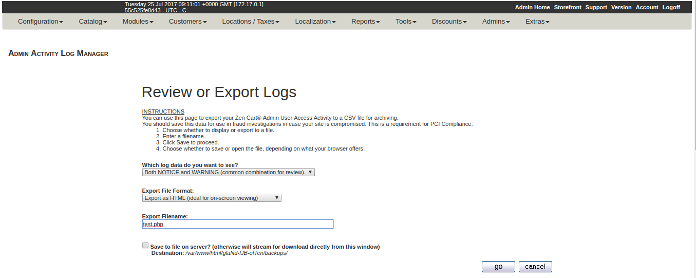
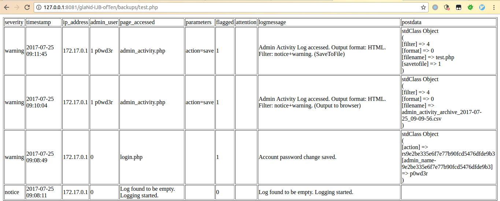
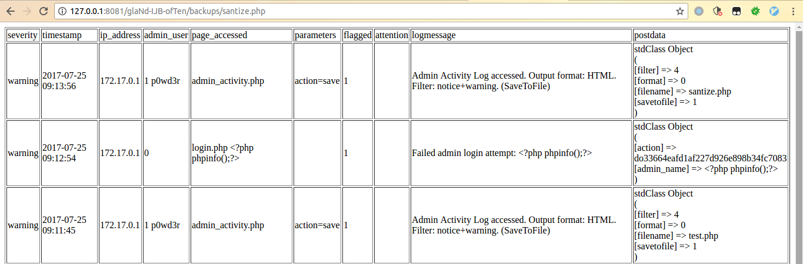
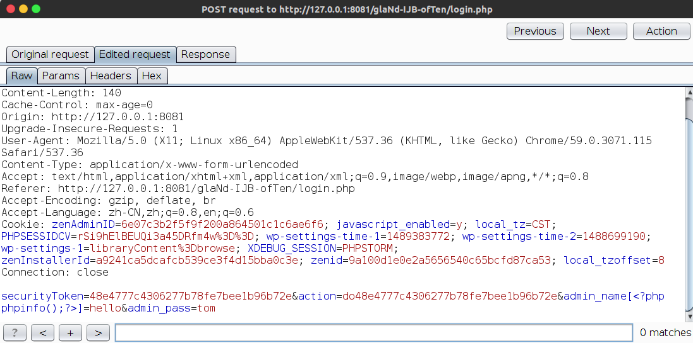
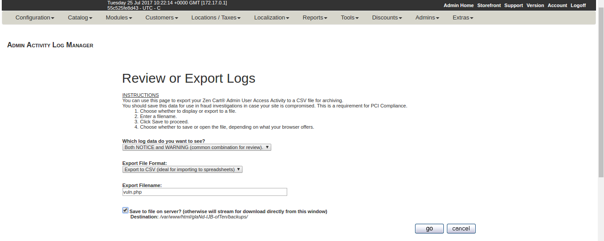
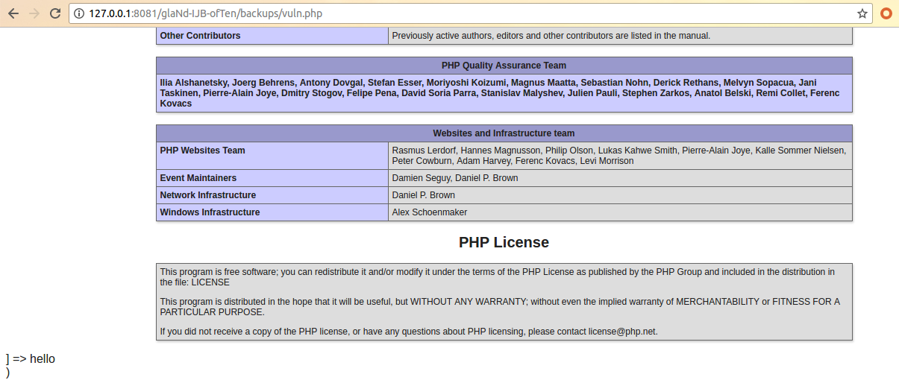

# ZenCart 1.5.5e Authenticated Code Execution Vulnerability

## Technical Description:

ZenCart's administrator can save the management log into the disk, the URL is  [http://host/admin_dir/admin_activity.php]().(The admin_dir is randomly generated by the system).



Here you can change the file name to `.php` suffix and check the bottom option to allow the system to keep the log in the `/backups/` under the admin directory.



You can see that the `postdata` column lists the data we requested through POST. When the POST data contains some php code like `<?php phpinfo();?>`, it will be HTML escaped by the system.



So we should try to bypass it.

The first escape takes place in the `traverseStrictSanitize` function in `admin_dir/includes/classes/AdminRequestSanitizer.php`:

```php
private function traverseStrictSanitize(&$item, $ignore, $inner, $type)
{
    foreach ($item as $k => $v) {
        if ($inner || (!$inner && !in_array($k, $ignore))) {
            if (is_array($v)) {
                $item[$k] = $this->traverseStrictSanitize($v, $ignore, true, $type);
            } else {
                $this->debugMessages[] = 'PROCESSING STRICT_SANITIZE_VALUES == ' . $k;
                $item[$k] = htmlspecialchars($item[$k]);
            }
        }
        ...
    }
    return $item;
}
```

It use `htmlspecialchars` to sanitize the request **value**, but it doesn't sanitize the request **key**. So we could put the code in the key just like `admin_name[<?php phpinfo();?>] = test` to bypass this function.

The second escape takes place in `admin_dir/admin_activity.php`:

```php
 // output non-XML data-format
$postoutput = print_r(json_decode(@gzinflate($result->fields['gzpost'])), true);
if ($format == 'HTML') {
    $postoutput = nl2br(zen_output_string_protected($postoutput));
} else {
    $postoutput = nl2br($postoutput);
}
```

The `zen_output_string_protected` will call `htmlspecialchars` finally.

The `$format` can be set when we export the log file, now supports both HTML and CSV formats, so just select CSV to bypass it.

## Proof of Concept (PoC)

Login request sent to `admin_dir/login.php`:



We put the code in `admin_name[<?php phpinfo();?>=hello` and send the request, the system will log this request because of the incorrect data.  Then we log in as administrator to export the log in CSV format to `admin_dir/backups/vuln.php`.


 
 The code will be executed when we visit `http://host/admin_dir/backups/vuln.php`.


